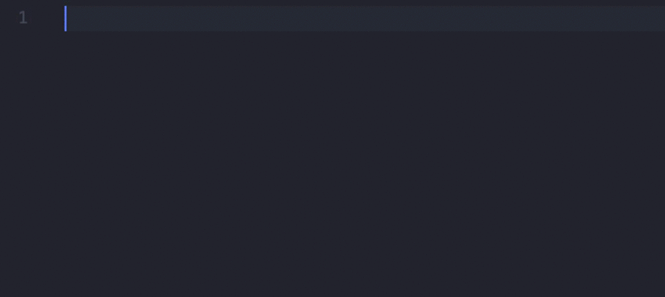

# Simple Functional React Snippets

Exceptionally simple snippets for creating React function components in Visual Studio Code.



## Snippets

Nothing more, nothing less than what you need to start composing a component. These snippets provide multiple cursors where `|` is shown.

### fc - Create a function component

```javascript
import React from 'react';

function | () {
}

export default |;
```

### lfc - Create a lambda function component

```javascript
import React from 'react';

const | = () => {
}

export default |;
```

### fcr - Create a function component with a return statement

> Hit tab to move to the next placeholder

```javascript
import React from 'react';

function | () {
  return (
    |
  );
}

export default |;
```

### lfcr - Create a lambda function component with a return statement

> Hit tab to move to the next placeholder

```javascript
import React from 'react';

const | = () => {
  return (
    |
  );
}

export default |;
```
